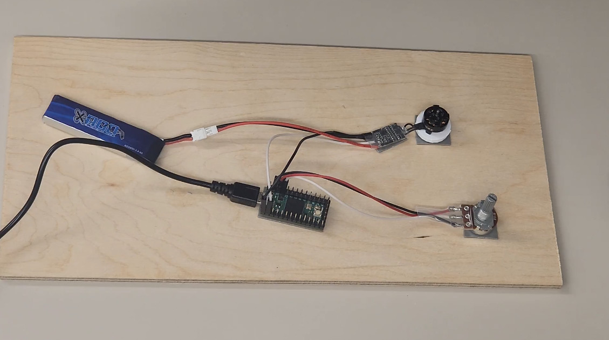

<a href="https://www.youtube.com/watch?v=b7x2g3awrsw"></a>

This a simple, header-only C++ library for using a 
[Teensy](https://www.pjrc.com/teensy/)
microcontroller board to run brushless motors via an electronic speed
controller (ESC) supporting the popular
[OneShot125](https://oscarliang.com/oneshot125-esc-quadcopter-fpv/) protocol.  I adapted the code from
Nicholas Rehm's awesome
[dRehmFlight](https://github.com/nickrehm/dRehmFlight) repository, with the goal of allowing
fellow Teensy lovers to use this kind of ESC in other projects.

As shown in the sketch below (which I used for making this
[video](https://www.youtube.com/watch?v=b7x2g3awrsw)), 
the API for the library is very simple: 

1. Declare a OneShot125 object, passing it a list of pins

2. In your ```setup()``` function, call the object's ```arm()``` function to arm the motors

3. In your ```loop()``` function, call the object's ```set()``` function to set the pulse
width on each pin; then call the ```run()``` function to run the motors at the specified
pulse widths.

```
static const std::vector<uint8_t> PINS = {0};

static auto motors = OneShot125(PINS);

void setup() 
{
    inputInit();

    motors.arm(); 
}

void loop() 
{
    auto pulseWidth = map(inputGet(), 0, 1, 125, 250);

    motors.set(0, pulseWidth);

    motors.run();
}
```

In this sketch, ```inputInit()``` is a (possibly empty) function that sets up
your input device, such as an R/C receiver.  The ```getInput()``` function returns
a floating-point value between 0 and 1, such as the normalized throttle or
potentiometer reading.

## Calibrating your ESCs

Before using this library in your project, you should 
[calibrate](examples/Calibrate) the ESCs.

Calibration means that when your input (e.g., throttle stick) is in its max
position, you'll be sending the maximum pulse with of 250 uSec to each ESC, 
and when your input is at its minimum 125uSec pulse width.
The Calibration sketch allows you to do this, using either the sort of
potentiometer shown in the video, or the more common method of and R/C 
transmitter/receiver.
